# Redes
É a conexão entre vários dispositivos entre sí.
Posso tamber ter sub-redes (redes dentro das redes). São também chamadas de sub-nets.

É aqui que entra o conceite de R.Privada vs Pública.

- Privada -> quando não consigo acessar via internet
- Pública -> Quando consigo acessar via internet

É importante saber por conta do fator segurança.

Não faz sentido o usuário ter acessar à base de dadps (exempl ode subnets abaixo)

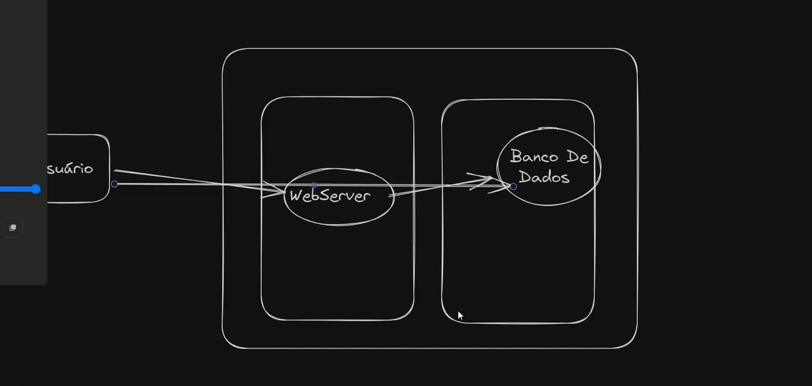.

Esse conceito é implementado em qualquer infraestrutura. Porém o foco aqui é a AWS.

# VPC (Virtual Private Cloud)
Exemplo:
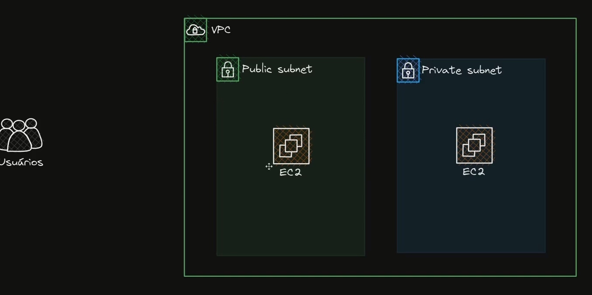
No exemplo acima, a primeira subnet (em verde) é pública e sagunad privada.

Para eu permitir que uma subnet seja pública, eu preciso ter um **Internet Gateway** dentro da VPC.

Obs: **Internet Gateway** é diferente de **API Gateway**

Porém, ainda sim preciso ter um Route Table dentro da Subnet:

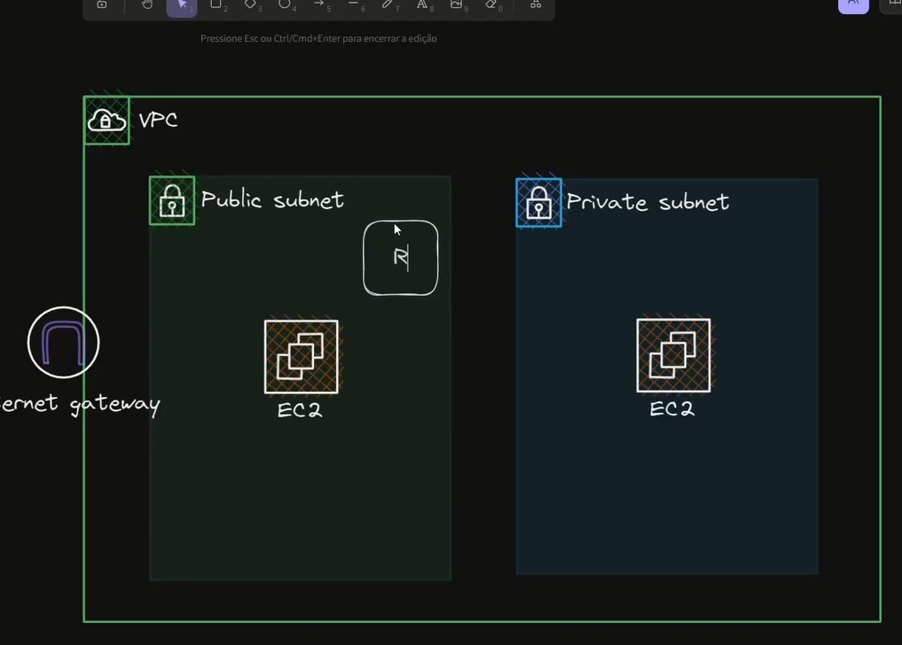

Ou seja, qualquer chamda sempre passa pela rabela de rotas.
É a combnação das rotas (na tabela de rotas) com o internet gatway é o que vai fazer a rede ser pública ou privada.

Quando eu não associo um subnet a um **Internet Gateway**, eu isolo essa subnet.

Esse conceito de 'entrar numa máquina para acessar algum elemento dentro de uma rede privada' é o que chammoss **'jump server'** ou **'bastion host'**.

Porém, para eu conseguir fazer requisições e elas serem retornar do Server na rede privada, é necessário existir um Net GTW:

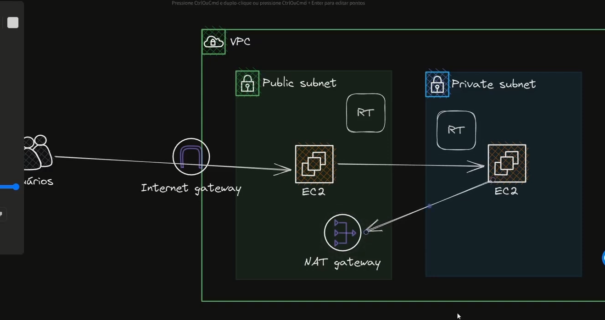

Em seguida, preciso (após adicionar o Nat GTW). Adicionar no **Route Table** dentro da rede privada.

[Vídio explicando](https://www.youtube.com/watch?v=bd4ribSTs-Y)


----

# From Project Hospital

## Criando VPC:


```hcl
resource "aws_vpc" "main" {
  cidr_block           = "10.0.0.0/16"
  enable_dns_hostnames = true
  enable_dns_support   = true
  tags                 = { Name = "vpc-rds-estudo" }
}
```

**aws_vpc:** VPC (Virtual Private Cloud) é uma rede virtual logicamente isolada na AWS. Imagine que a AWS é um prédio comercial gigante e a VPC é a sua sala privativa. Ninguém entra ou sai sem sua permissão, e você define o layout interno (subnets, roteamento).

**cidr_block:** definição do espaço de endereçamento IP da sua rede.

- O que é CIDR? Significa **Classless Inter-Domain Routing.**
- O "10.0.0.0": É o endereço base da rede.
- O "/16": É a máscara de sub-rede. Na prática, o número 16 indica que os primeiros 16 bits são fixos para a rede.
- Capacidade: Uma rede /16 permite até 65.536 endereços IP (vai de 10.0.0.0 até 10.0.255.255).

O IPv4 tem capacidade de 32 bits quando convertido para binário (só contar a quantidade de 1 e 0):
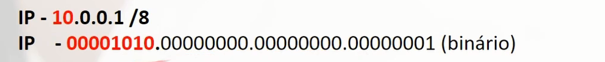

Quando eu digo que um IP é /8, significa que os primeiros 8 bits são os idnetificadores dessa rede. Isso vale para /16 e /24. (quanto menor o número, maior a rede).

É a primeira parte da rede que não muda:
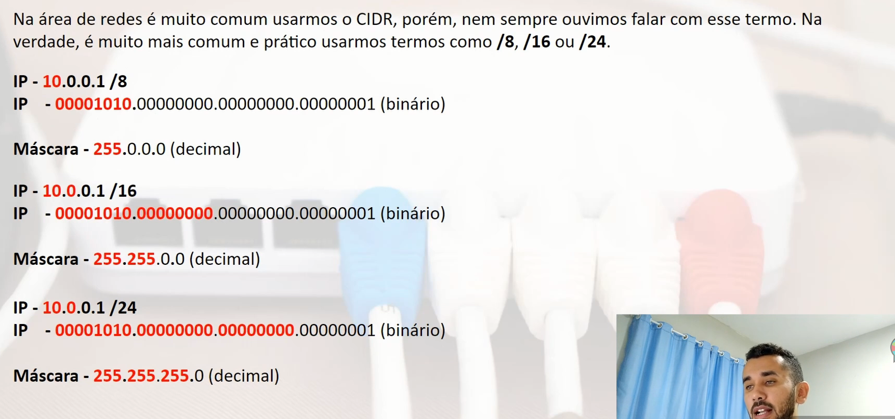

Os demais bits são os bits utilizados para identificar os hosts.

Para calcular:
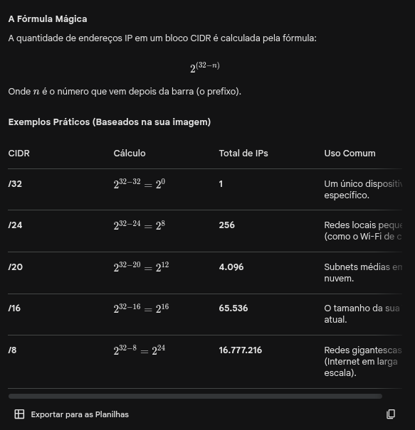

**enable_dns_hostnames:** eu adiciono quando eu quero acessar os recurusos dentro da VPC via DNS e não via IP.
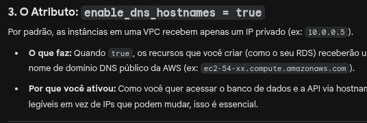

**enable_dns_support:** Isso indica se a VPC deve suportar resoluções de nomes através do servidor de DNS da própria AWS (o Amazon Provided DNS).
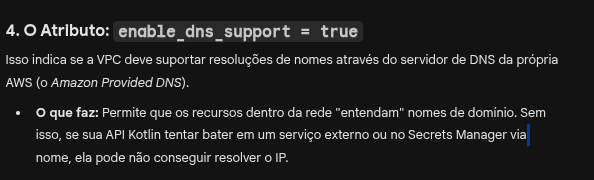

**vpc-rds-estudo:** Na AWS, quase tudo é identificado por um ID aleatório (ex: vpc-0a1b2c3d).
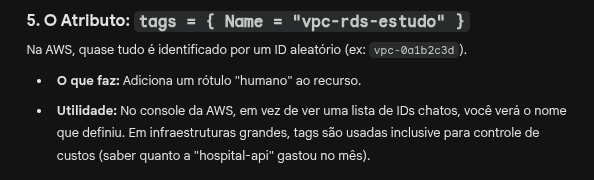

## Internet Gateway: 

1. O que é o Internet Gateway?
É um componente da VPC que permite a comunicação entre a sua rede e a internet. Ele cumpre duas funções fundamentais:

```hcl
resource "aws_internet_gateway" "gw" {
  vpc_id = aws_vpc.main.id
}
```
Se a VPC é a sua "sala privativa" no prédio da AWS, o Internet Gateway (IGW) é a porta de entrada e saída para a rua.

**vpc_id = aws_vpc.main.id:** Este é o "link" lógico. O IGW não serve para nada se não estiver anexado (attached) a uma VPC.

## Route Table: 

A Route Table é consultada quando um recurso dentro da sua VPC (como sua API Kotlin) quer enviar algo para fora.

- Exemplo: Sua API precisa consultar o Secrets Manager ou baixar uma dependência.

- O destino é um IP da AWS ou da Internet (ex: 52.x.x.x).

- A placa de sinalização olha: "52.x.x.x não começa com 10.0.x.x? Então ele cai na regra 0.0.0.0/0 e eu despacho ele pelo portão (Internet Gateway)".

cidr_block = "0.0.0.0/0": Na linguagem de redes, 0.0.0.0/0 significa **"qualquer lugar"** ou **"toda a internet"**. É uma rota padrão (default route). Ela diz: "Se o destino do pacote não for um IP interno da nossa rede ( ), mande para cá".

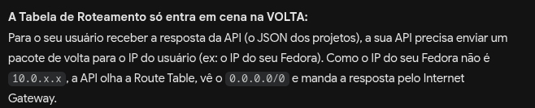

### O Padrão da Norma (RFC 1918)
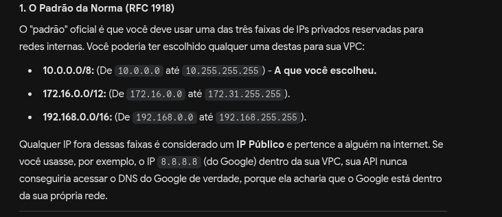


```hcl
resource "aws_route_table" "public_rt" {
  vpc_id = aws_vpc.main.id
  route {
    cidr_block = "0.0.0.0/0"
    gateway_id = aws_internet_gateway.gw.id
  }
}
```

### Bloco Route:
Aqui é onde você define as regras de trânsito.

- **cidr_block = "0.0.0.0/0":** Na linguagem de redes, 0.0.0.0/0 significa "qualquer lugar" ou "toda a internet". É uma rota padrão (default route). Ela diz: "Se o destino do pacote não for um IP interno da nossa rede (10.0.x.x), mande para cá".

- **gateway_id = aws_internet_gateway.gw.id:** Aqui você define o destino. Você está dizendo: "Tudo o que for para fora da nossa rede, jogue para o Internet Gateway".


### Subnet:

#### 1. O Atributo: **count = 2**

  Em vez de escrever dois blocos resource "aws_subnet", você está dizendo ao Terraform: "Repita a criação deste recurso duas vezes".

  Isso vai gerar duas subnets: subnets[0] e subnets[1].

#### 2. O Atributo: **cidr_block = "10.0.${count.index + 1}.0/24"**
Lembra que a sua VPC é 10.0.0.0/16? Agora você está fatiando ela em pedaços menores (/24).

  Na primeira volta (count.index é 0): O IP será 10.0.1.0/24.

  Na segunda volta (count.index é 1): O IP será 10.0.2.0/24.

  **Por que /24?** Como vimos, cada /24 te dá 256 IPs. É mais do que suficiente para os containers da sua API e para o seu RDS. Usar subnets diferentes ajuda a organizar o que é público e o que é privado.

#### 3. **O Atributo: availability_zone**
  Este é um conceito fundamental de Alta Disponibilidade (High Availability) na AWS.

  A AWS divide suas regiões (como us-east-1) em Zonas de Disponibilidade (AZs), que são data centers fisicamente separados.

  Esse código garante que a Subnet 1 fique na AZ A e a Subnet 2 na AZ B.

  O benefício: Se um trator cortar a fibra ótica de um data center da AWS na Virgínia, sua aplicação continua rodando no outro. Para o seu RDS, isso é vital para evitar perda de dados.

#### 4. **O Atributo: map_public_ip_on_launch = true**
Essa é a flag que torna essas subnets Públicas.

Quando **true**, qualquer recurso criado aqui (como um container do ECS ou uma instância EC2) ganhará automaticamente um IP Público da AWS.

Sem isso, seu container teria apenas o IP interno (10.0.x.x) e você não conseguiria acessá-lo via internet, mesmo com o Internet Gateway configurado.


### Security Group

Pense no **Security Group (SG)** como o segurança da porta do seu recurso. Se a VPC é o prédio e a Subnet é o andar, o Security Group é quem fica na porta da sala controlando a lista de quem entra e quem sai.

Diferente da **Route Table**, que diz o caminho, o Security Group diz se você tem permissão.
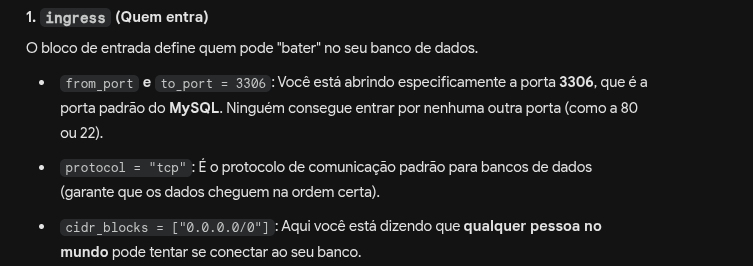

Ou seja, seria ideia deixar o BD dentro de um subnet privada e acessar ela somente via API.
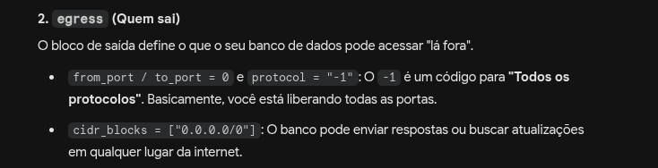

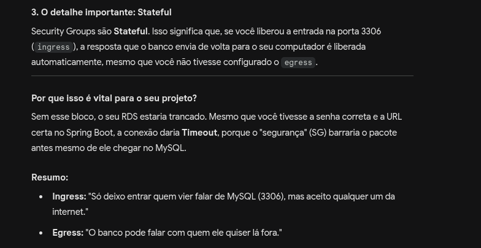

---

## Questão do ALB vs NLB:

**O papel do API Gateway (O seu verdadeiro "Gateway")**

Se você pretende usar o API Gateway, ele provavelmente será a "cara" da sua aplicação para o mundo. O fluxo ficaria assim:

Internet -> API Gateway -> NLB -> ECS -> RDS

Nesse cenário, o ALB é totalmente opcional. O API Gateway se conecta ao NLB (geralmente via um recurso chamado VPC Link) e o NLB entrega o pacote para o container. Muitas arquiteturas de alta performance no setor bancário (como onde você trabalha) preferem o NLB por ser mais rápido e ter latência menor que o ALB.

---

## Subindo ECS

### Criar o Repositório no ECR
O ECS não baixa imagem do seu computador. Ele baixa do Amazon ECR (o "Docker Hub" da AWS). Antes de subir o código, você precisa criar o lugar onde a imagem vai morar:

##### Execute no terminal

aws ecr create-repository --repository-name hospital-api --region us-east-1 

## comandos para mandar a img pro ecr
aws ecr get-login-password --region <REGIAO> | docker login --username AWS --password-stdin <ID_DA_CONTA>.dkr.ecr.<REGIAO>.amazonaws.com
docker build -t hospital-api .
docker tag hospital-api:latest <ID_DA_CONTA>. dkr.ecr.<REGIAO>.amazonaws.com/hospital-api:latest
docker push <ID_DA_CONTA>.dkr.ecr.<REGIAO>.amazonaws.com/hospital-api:latest
aws ecs update-service --cluster hospital-cluster --service hospital-service --force-new-deployment
